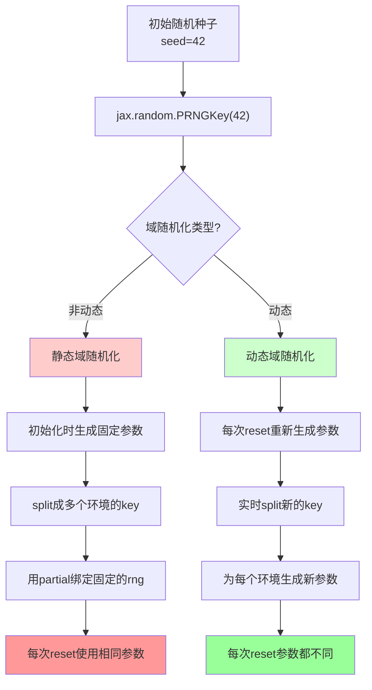
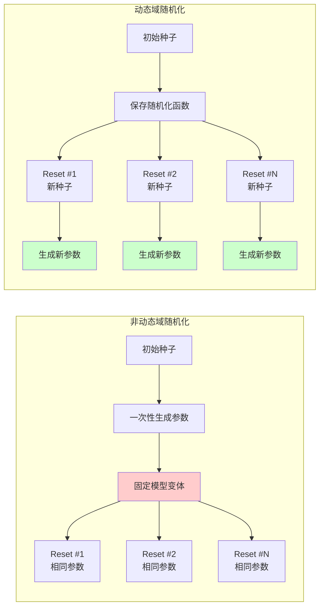

# Jax 的随机数种子

## 1️⃣ JAX随机数基础概念

### 1.1.  JAX随机数与NumPy的区别
```python
# ❌ NumPy方式 (全局状态)
import numpy as np
np.random.seed(42)
x = np.random.normal()  # 依赖全局状态
y = np.random.normal()  # 状态已改变

# ✅ JAX方式 (函数式)
import jax
key = jax.random.PRNGKey(42)  # 创建种子
key1, key2 = jax.random.split(key)  # 分裂种子
x = jax.random.normal(key1)  # 使用独立的key
y = jax.random.normal(key2)  # 使用另一个独立的key
```

### 1.2. 关键原则
- 函数式：不修改现有状态，而是创建新的随机状态
- 确定性：相同的key总是产生相同的结果
- 可并行：不同的key可以安全地并行使用

## 2️⃣ 结合 MuJoCo Playground 的域随机化

### 2.1. 非动态域随机化的随机数流程
```python
# === 非动态域随机化流程 ===

# 步骤1: 初始化阶段
seed = 42
main_key = jax.random.PRNGKey(seed)  # 主随机种子

# 步骤2: 分离用途的随机种子
key_reset, key_randomization = jax.random.split(main_key)

# 步骤3: 为多个并行环境生成固定的随机种子
num_envs = 4096
randomization_rng = jax.random.split(key_randomization, num_envs)
# randomization_rng.shape = (4096, 2)  # 每个环境一个独立的种子

# 步骤4: 用functools.partial "冻结"随机种子
v_randomization_fn = functools.partial(
    domain_randomize,  # 域随机化函数
    rng=randomization_rng  # 固定的随机种子数组
)

# 步骤5: 在包装器初始化时调用一次
model_variants, in_axes = v_randomization_fn(base_model)
# 这里生成了4096个不同的模型变体，每个都有不同的物理参数

# 步骤6: 每次reset时使用相同的模型变体
def reset(rng):
    # 这里的model_variants是固定的，不会改变
    # 只有环境的初始状态会根据rng变化
    return env.reset_with_fixed_physics(model_variants, rng)
```

**非动态的问题**
```python
# 第1次reset
reset(key1)  # 使用model_variants[0] - 摩擦力=0.7, 质量=1.2kg

# 第2次reset  
reset(key2)  # 还是使用model_variants[0] - 摩擦力=0.7, 质量=1.2kg (相同!)

# 第100次reset
reset(key100)  # 依然使用model_variants[0] - 摩擦力=0.7, 质量=1.2kg (相同!)
```

### 2.2. 动态域随机化的随机数流程
```python
# === 动态域随机化流程 ===

# 步骤1: 初始化阶段 (相同)
seed = 42
main_key = jax.random.PRNGKey(seed)

# 步骤2: 保存基础随机化函数 (不绑定种子)
base_randomization_fn = domain_randomize  # 不使用functools.partial

# 步骤3: 在包装器中保存当前随机状态
current_rng_key = main_key  # 跟踪当前状态

# 步骤4: 每次reset时的流程
def dynamic_reset(rng):
    # 4a: 处理输入随机种子
    if rng.ndim == 1:  # 单个种子
        rng_batch = jax.random.split(rng, num_envs)
    else:  # 已经是批量种子
        rng_batch = rng
    
    # 4b: 为每个环境分别生成域随机化和重置的种子
    dr_reset_keys = jax.vmap(jax.random.split)(rng_batch)
    dr_keys = dr_reset_keys[:, 0]    # 用于域随机化
    reset_keys = dr_reset_keys[:, 1]  # 用于环境重置
    
    # 4c: 实时生成新的模型变体
    new_model_variants, _ = base_randomization_fn(base_model, dr_keys)
    
    # 4d: 使用新的模型变体重置环境
    return env.reset_with_new_physics(new_model_variants, reset_keys)
```

**动态的优势**
```python
# 主种子固定为42
seed = 42
env = RSLRLBraxWrapper(..., seed=42, dynamic_randomization=True)

# 第一次运行
reset1 = env.reset()  # 摩擦力=0.7, 质量=1.2kg
reset2 = env.reset()  # 摩擦力=0.5, 质量=0.9kg  
reset3 = env.reset()  # 摩擦力=0.8, 质量=1.1kg
# ... 100次

# 重新创建环境，相同种子
env_new = RSLRLBraxWrapper(..., seed=42, dynamic_randomization=True)

# 第二次运行 - 完全相同的序列！
reset1_new = env_new.reset()  # 摩擦力=0.7, 质量=1.2kg (相同)
reset2_new = env_new.reset()  # 摩擦力=0.5, 质量=0.9kg (相同)
reset3_new = env_new.reset()  # 摩擦力=0.8, 质量=1.1kg (相同)
```


### 2.3. Playground 域随机化函数内部的随机数使用
`domain_randomize` 函数内部：

```python
def domain_randomize(model: mjx.Model, rng: jax.Array):
    @jax.vmap  # 为每个环境并行执行
    def rand_dynamics(rng):
        # 重要：每次使用随机数前都要split!
        
        # 生成摩擦力参数
        rng, key = jax.random.split(rng)  # 分裂：保留rng用于后续，key用于当前
        friction = jax.random.uniform(key, minval=0.4, maxval=1.0)
        
        # 生成关节摩擦参数
        rng, key = jax.random.split(rng)  # 再次分裂
        frictionloss = model.dof_frictionloss[6:] * jax.random.uniform(
            key, shape=(29,), minval=0.5, maxval=2.0
        )
        
        # 生成质量参数
        rng, key = jax.random.split(rng)  # 继续分裂
        dmass = jax.random.uniform(
            key, shape=(model.nbody,), minval=0.9, maxval=1.1
        )
        
        # ... 更多参数生成
        
        return (friction_params, mass_params, ...)
    
    # 对所有环境并行执行随机化
    results = rand_dynamics(rng)  # rng.shape = (num_envs, 2)
    
    return modified_model, in_axes
```

## 3️⃣ 关键区别总结

### 3.1. 性能和训练效果对比

| 特征 | 非动态域随机化 | 动态域随机化 |
|------|----------------|--------------|
| 计算开销 | 低（参数预计算）| 稍高（每次reset计算）|
| 内存使用 | 存储所有模型变体 | 只存储基础模型 |
| 训练多样性 | 有限（固定参数集）| 高（无限参数变化）|
| 收敛速度 | 可能过拟合 | 更好的泛化能力 |
| 适用场景 | 评估、对比实验 | 训练、提高鲁棒性 |
