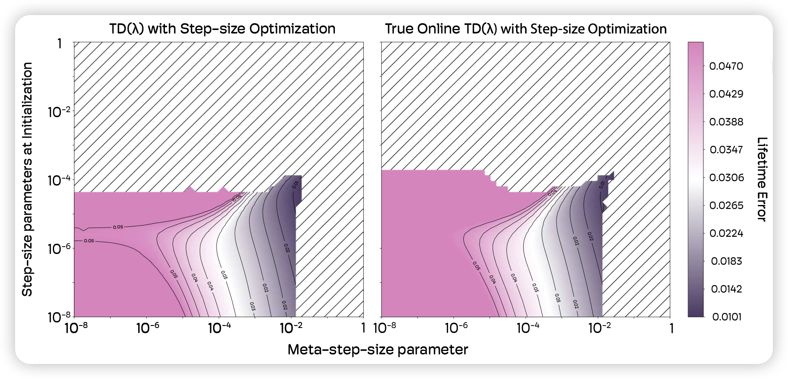
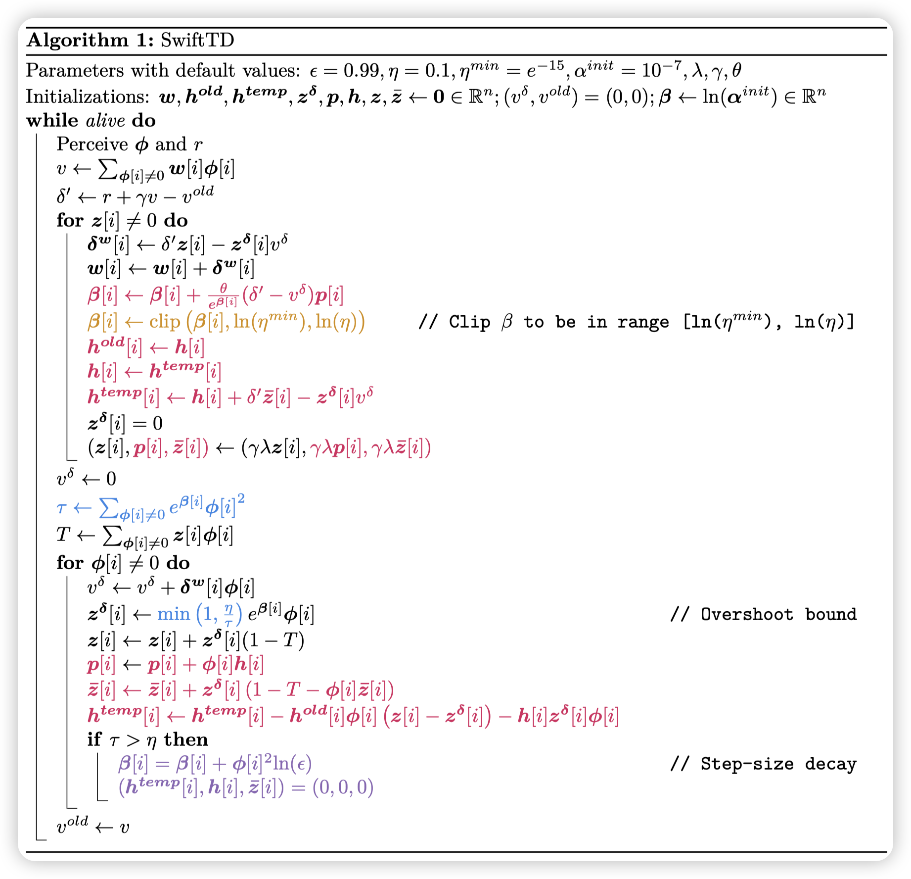
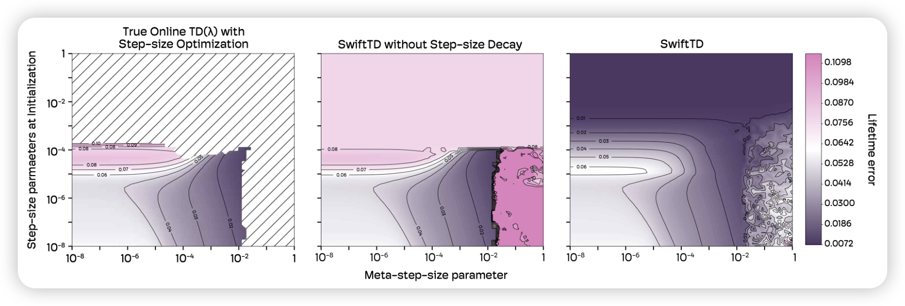
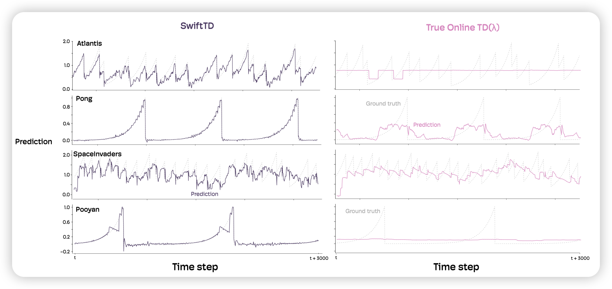
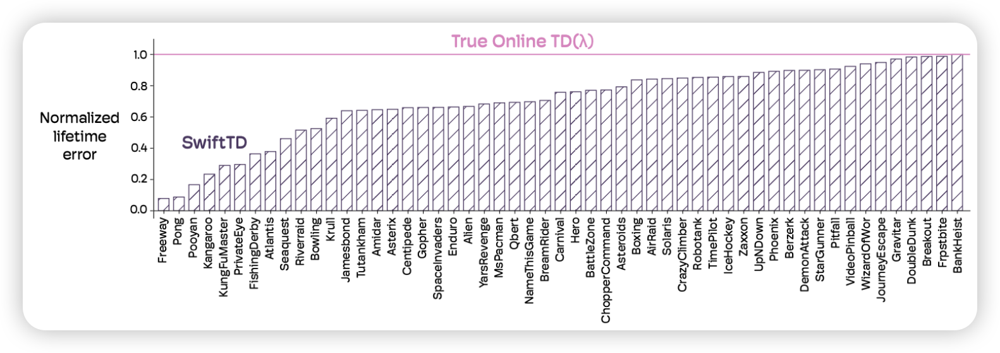

# SwiftTD - A Fast and Robust Algorithm for Temporal Difference Learning -- Sutton

## 0️⃣ 论文总结

这篇论文介绍了一种名为 **SwiftTD** 的新型时序差分（TD）学习算法，旨在解决现有 TD 算法在学习速度和稳定性之间的权衡问题。传统 TD 算法通常需要在“缓慢但稳定”（小步长）和“快速但可能发散”（大步长）之间做出艰难选择。SwiftTD 的目标是提供第四种选择：一种能够快速、稳健地学习，并且不需要像经验回放（replay buffer）那样进行多次更新的算法。

---

### 核心问题
* **时序差分（TD）学习的困境**：TD 学习是强化学习中用于进行时序预测的核心方法。然而，它长期面临一个挑战：使用小步长（学习率）会导致学习过程非常缓慢；而使用大步长虽然可能加速学习，却极易导致算法发散，使得预测变得不稳定。
* **计算效率**：虽然使用经验回放等技术可以稳定学习，但这需要存储大量数据并进行多次重复更新，不仅计算成本高，也降低了智能体对新信息的反应速度。

---

### SwiftTD 的解决方案：三大核心创新点

SwiftTD 算法建立在 **True Online TD($\lambda$)** 算法之上，并创新性地结合了以下三个关键思想，使其能够实现快速且鲁棒的学习：

1.  **带步长优化的时序差分学习 (TD Learning with Step-size Optimization)**
    * **机制**：SwiftTD 不使用单一的全局步长，而是为每个特征（feature）分配一个独立的、可学习的步长参数。
    * **目的**：通过元学习（meta-learning）机制，算法能够根据经验自动调整每个特征的步长。对于预测性强的“重要”特征，其步长会增大；对于“无关”或“噪声”特征，其步长会减小。这极大地改善了信用分配（credit assignment）的效率和准确性。

2.  **过冲约束 (The Overshoot Bound)**
    * **机制**：为资格向量（eligibility vector）的更新引入一个边界，确保每次更新后，新的预测值不会“越过”目标值。
    * **目的**：这个约束从根本上防止了因步长过大而导致的“过度修正”（overcorrections）和算法发散。实验证明，该约束与 True Online $TD(\lambda)$ 结合时效果显著，保证了算法在大步长下的稳定性。

3.  **步长衰减 (Step-size Decay)**
    * **机制**：当“过冲约束”被触发时，这本身就是一个明确的信号，表明某些特征的步长过大。此时，算法会按贡献比例自动衰减（减小）那些导致过冲的特征的步长。
    * **目的**：这一机制与过冲约束协同工作，使算法能够自我纠正过大的步长，从而对超参数（如初始步长和元学习率）的选择不敏感，表现出极高的鲁棒性。

---

### 实验评估与关键结果

论文通过 **Atari 预测基准测试** 对 SwiftTD 进行了广泛评估。

* **鲁棒性**：超参数敏感性分析显示，SwiftTD 在极宽的超参数范围内都能保持稳定和优异的性能，而其他算法在相同设置下很容易发散。
* **性能**：
    * 在几乎所有的 Atari 游戏中，SwiftTD 的学习速度和最终预测准确性（以生命周期误差衡量）都显著优于 True Online $TD(\lambda)$，在某些游戏中性能提升了一个数量级。
    * 可视化结果表明，SwiftTD 学习到的预测与真实回报（ground-truth returns）高度吻合，而基线算法的预测则有很大偏差。
* **与神经网络结合**：论文还展示了 SwiftTD 可以成功应用于卷积神经网络的最后一层。即使在这种设置下，SwiftTD 依然能显著提升网络的预测性能，证明了其在更复杂模型中的应用潜力。

---

### 结论与意义

SwiftTD 成功地将步长优化、过冲约束和步长衰减三大机制结合起来，创造了一种快速、鲁棒且计算高效的 TD 学习算法。它解决了在线学习中稳定性和速度之间的核心矛盾，使其有潜力成为在线预测任务的首选算法，并为实现无需经验回放的高效强化学习铺平了道路。

---

<!-- :::pdf
SwiftTD.pdf
::: -->

## 1️⃣ 预测未来的重要性与挑战
### 1.1. 核心思想
能够预测未来的算法具有重要价值。准确的未来预测是实现**稳健决策、规划与推理**的基础。一个智能体若要选择最优动作，必须能够预判不同行动带来的结果。此外，预测能力也是一种**对世界知识的编码方式**——与依赖真实标签的监督学习不同，预测可仅通过经验进行学习，因此具备**良好的可扩展性**。
### 1.2. 关键挑战：延迟反馈
许多预测任务（例如“两小时后会下雨吗？”）需要等待实际结果出现才能获得真实标签。若采用朴素方法——存储全部经验并等待反馈，会导致**可扩展性差**。
### 1.3. 解决方案：时序差分（TD）学习与资格迹
为应对延迟反馈问题，**时序差分（Temporal Difference, TD）学习**提供了一种在线且可扩展的机制。它不仅支持高效的学习，还是众多强化学习算法的核心组件，包括：
- Sarsa(λ)
- Q-learning
- PPO（近端策略优化）
- Actor-Critic
 
因此，**改进TD学习具有广泛影响**——可同时提升上述所有算法的性能。
### 1.4. 现有方法的局限性
当前TD学习算法在**增量式、快速学习**方面表现不佳，常面临以下三种不理想选择：
1. **小步长 + 长期学习**：稳定但速度慢。  
2. **大步长直接更新**：可能加速学习，但存在发散风险。  
3. **小步长 + 多次更新（如使用经验回放）**：虽实现样本高效与鲁棒性，但存在以下问题：
   - 计算资源浪费；
   - 在复杂环境中性能下降；
   - 导致智能体**反应迟缓**——反馈无法立即反映在预测与行为中。

:::warning[核心问题总结]
现有方法难以兼顾**学习速度、稳定性与实时性**。如何实现快速、稳定且即时的预测更新，是提升智能体适应能力的关键。
:::

---

## 2️⃣ SwiftTD 的设计目标与核心思想
### 2.1. 目标：实现第四种高效学习范式
我们提出 SwiftTD 的目标是**突破现有三类选择的局限**，提供一种全新的第四种可能：  
> 一个能够**快速学习、不会发散、且无需多次更新即可从反馈中即时吸收知识**的TD学习算法。

这样的机制将实现以下优势： 
- 智能体可**在数据流中实时学习**，消除对 **经验回放（replay buffer）** 的依赖，降低存储与计算开销；
- 提升智能体的**响应速度与适应性**，使预测与行为能立即反映最新反馈。 

### 2.2. 核心思想 
我们发现了三个关键思想。**单独来看，每个思想均不足以实现快速且鲁棒的学习；但三者协同作用时，才真正实现了 SwiftTD 的高效性能**。
这三项核心创新如下：
1. **特征级步长优化（Per-feature step-size optimization）**  
   为每个状态特征动态调整学习率，提升学习效率与稳定性。
2. **对资格迹增量施加约束（Bound on the increment to the eligibility vector）**  
   限制资格迹的更新幅度，防止因过大修正导致系统震荡或发散。
3. **基于过大的步长参数进行选择性衰减机制**  
   当检测到某些特征的步长过大时，自动降低其学习率，避免不稳定的更新。

### 2.3. 前置基础：支撑 SwiftTD 的两大核心算法
在详细介绍上述三项创新之前，我们首先简要回顾两项支撑性算法——SwiftTD 的构建基础：
- **True Online TD(λ)**：一种具有理论保证的在线TD学习方法，能更准确地估计目标值，是实现高效更新的核心框架。
- **Incremental Delta-bar Delta (IDBD)** ：一种用于特征级步长优化的元学习算法，能根据特征的学习效果动态调整其步长。
 
#### 2.3.1 λ-回报（λ-return）——多步回溯的精确目标 
**λ-回报**是一种基于多步回溯（multistep bootstrapped return）的广义回报形式，它将所有 $n$-步回报加权融合：
$$
G^\lambda_t \triangleq (1 - \lambda) \sum_{n=1}^{\infty} \lambda^{n-1} G_{t:t+n},
\quad \text{其中} \quad
G_{t:t+n} \triangleq r_{t+1} + \gamma r_{t+2} + \cdots + \gamma^{n-1} r_{t+n} + \gamma^n v_{t+n}.
$$

✅ **参数解释**：
- $v_{t+n}$ 是智能体在时间 $t+n$ 对未来总折扣奖励的估计；
- $\lambda \in [0,1]$ 控制回溯长度：$\lambda=0$ 时退化为单步回报，$\lambda=1$ 时接近蒙特卡洛目标；
- $\lambda$-回报的**独特优势**在于：可通过资格迹（eligibility traces）实现**高效在线计算**，无需存储完整轨迹。
 
最基础的基于 $\lambda$-回报的学习算法是 **TD(λ)**（Sutton, 1988）。然而，其权重更新**并非精确匹配 $\lambda$-回报的目标**，仅在步长参数较小时为良好近似。
 

#### 2.3.2 True Online TD(λ) —— 精确匹配在线 $\lambda$-回报
为解决 TD(λ) 的近似偏差问题，**True Online TD(λ)**（Van Seijen et al., 2016）被提出。该算法与 **Online $\lambda$-return 算法**完全匹配（Sutton & Barto, 2018），且无需依赖资格迹。 

🔑 **核心优势**
- 在使用**大步长参数时仍保持稳定与准确**；
- 与原始 Online $\lambda$-return 算法在理论上完全一致，但具备更高效的在线更新能力。 
 
#### 2.3.3 增量式 Delta-bar-Delta（IDBD）——特征级步长的元学习机制
**Incremental Delta-bar-Delta (IDBD)**（Sutton, 1992）是一种用于**线性回归中自适应调整每特征步长参数的元学习算法**。

**🔑核心思想**
- 它使用基于梯度的元学习，并通过前向视角微分（Williams & Zipser, 1989）逐步逼近梯度。  

**💡直观理解**
- 对**泛化能力强的特征**：自动提升其步长，加速学习；
- 对**泛化能力差或噪声大的特征**：自动降低其步长，避免过度扰动。
 
📌 **关键区别于主流自适应步长调整算法**： 
| 算法 | 机制本质 |
|------|----------|
| **IDBD** | 做的是 **步长参数优化（step-size optimization）**，调整学习率以优化损失 |
| **RMSProp / Adam** | 做的是 **步长归一化（step-size normalization）**，仅调整尺度而忽略了损失的变化趋势（landscape） | 

### 2.4. 时间预测问题的形式化定义 
#### 2.4.1. 核心构成：观测与预测
智能体在时间步 $t$ 接收一个观测向量 $\bm\phi_t \in \mathbb{R}^n$，并据此做出一个**标量预测** $v_t$。
#### 2.4.2. 预测目标：基于累积奖励的未来值
预测的评估依据是未来某个标量（称为**累积量，cumulant**）的总和。该累积量可以是观测向量 $\bm\phi_t$ 的任意标量分量，**最常见的选择是奖励信号 $r_t$**。
#### 2.4.3. 性能度量：生命周期误差（Lifetime Error）
智能体在生命周期 $T$ 内的性能由**生命周期误差**衡量：
$$
\text{Lifetime error}(T) = \frac{1}{T} \sum_{t=1}^{T} \left( v_t - \sum_{j=t+1}^{T} \gamma^{j-t-1} r_j \right)^2,
$$
其中：
- $r_t$ 是观测 $\bm\phi_t$ 的一个分量，是 $t$ 时刻的累计量； 
- $T$：智能体的生命周期（总时间步数）；
- $\gamma \in [0,1)$：折扣因子，属于问题定义的一部分。

✅ **关键特性**： 
- 该误差不仅衡量学习结束时的预测质量，还反映智能体**发现正确解的速度**（累加了每一时刻的估计误差）；
- 它适用于在线学习场景——智能体在获得真实值前即需做出预测。
#### 2.4.4. 与传统评估范式的区别 
生命周期误差**不同于**将数据划分为独立训练集和测试集的主流范式。后者适用于离线学习，其中学习者可访问完整数据集；但在**在线学习中无需分隔数据**——智能体在获取真实反馈前即需完成预测。

---

## 3️⃣ Atari 预测基准（Atari Prediction Benchmark）
### 3.1. 基准概述
**Atari Prediction Benchmark**（Javed et al., 2023）是一套基于预测任务的评估框架，构建于 **Arcade Learning Environment (ALE)**（Bellemare et al., 2013）之上，涵盖多个 Atari 2600 游戏。
在每款游戏中，玩家可执行最多 **18 种离散动作**，目标是最大化得分。
### 3.2. 任务构建方式
为将 ALE 游戏转化为前文定义的**时间预测问题**，需明确以下要素：
- 观测向量（observation vector）；
- 累积量（cumulant）； 
- 折扣因子 $\gamma$；
- 智能体生命周期 $T$。

这些参数在各游戏中统一设定，具体如下：

### 3.3. 从游戏帧构建特征向量
#### 3.3.1. 原始输入 
Atari 游戏帧为尺寸 $210 \times 160 \times 3$ 的张量，每个元素为 $[0, 255]$ 范围内的整数。
#### 3.3.2. 预处理步骤
1. **缩放帧**：将原始帧重采样至 $105 \times 80 \times 3$；
2. **分箱编码（Binning）**：
   - 对每个通道的像素值进行**有损 one-hot 编码**；
   - 每个通道的像素值按区间划分：
     - $[0,31]$    → $(1, 0, ..., 0)$；
     - $[32,63]$   → $(0, 1, ..., 0)$；
     - …
     - $[224,255]$ → $(0, 0, ..., 1)$；
   - 每一通道生成一个 $105 \times 80 \times 8$ 的张量；
   - 三个通道共得 $105 \times 80 \times 24$ 的张量。

3. **展平与拼接**：
   - 将 $105 \times 80 \times 24$ 张量展平为长度 **201,600** 的二值向量；
   - 在其末尾附加：
     - 上一时刻的 one-hot 编码动作（18 维）；
     - 当前时刻的累积量（cumulant）。
最终得到长度为 **201,619** 的特征向量，作为智能体的观测输入。 

### 3.4. 其他参数设定
- **累积量（cumulant）**：基于 ALE 提供的奖励信号处理：
  - 正奖励 → 累积量设为 $+1$；
  - 负奖励 → 累积量设为 $-1$；
  - 零奖励 → 累积量为 $0$。
- **折扣因子**：所有游戏统一使用 $\gamma = 0.98$；
- **生命周期**：实验中设为 $T = 210,000$，相当于以每秒 30 帧的速度运行约 **2 小时**的游戏时间。

---

## 4️⃣ 三大核心思想的实现

每个智能体的策略由一个权重向量 $\bm{w} \in \mathbb{R}^n$ 参数化，其预测通过**线性组合特征向量与权重**实现：
$$
v_t = \sum_{i=1}^{n} \bm w_{t-1}[i] \cdot \bm\phi_t[i],
\quad \text{其中 } \bm\phi_t[i] \text{ 是观测向量 } \bm\phi_t \text{ 的第 } i \text{ 个分量}。
$$
权重向量的索引为 $t-1$，表示预测 $v_t$ 是在**使用当前观测 $\bm\phi_t$ 更新权重之前**做出的； 

### 4.1. Idea 1: 特征级步长优化（Per-feature step-size optimization）
> 这部分与论文 "Metatrace actor-critic: Online step-size tuning by meta-gradient descent for reinforcement learning control" 中的实现完全一致。

为实现**单次更新下的快速学习**，必须进行大步长的参数更新。  
但为保证**鲁棒性**，又需避免对噪声或无关特征的权重进行过大更新。

⚠️ **矛盾点**：  

若使用单一标量步长参数，这两项要求相互冲突——大步长易引发不稳定，小步长则无法快速学习。

🔑 **解决方案：引入特征级步长参数**： 

通过为每个权重分配独立的步长参数，可同时满足：
- 对重要特征进行**大更新**以加速学习；
- 对噪声或无关特征进行**小更新**以维持稳定性。

#### 4.1.1. 步长参数的学习机制
特征级步长参数引入后，由于权重数量可能达数百万，无法手动设定步长。因此，必须**从经验中学习这些参数**。

#### 4.1.2. 参数化方式
- 引入辅助向量 $\bm\beta \in \mathbb{R}^n$ 用于参数化步长；
- 权重更新中的实际步长设为：$\bm\alpha[i] = e^{\bm\beta[i]}$ 
> 📌 **优势**：指数形式确保步长始终为正，且便于梯度优化。

#### 4.1.3. 步长参数的更新规则
通过最小化预测误差对步长参数进行元学习（meta-learning），来得到使得预测误差最小的每个步长参数：
$$
\bm\beta_t[i] = \bm\beta_{t-1}[i] - \frac{\theta}{e^{\bm\beta[i]}} \cdot \frac{\partial (v_t - G^\lambda_t)^2}{\partial \beta[i]},
$$
其中：
- $\frac{\theta}{e^{\bm\beta[i]}}$ 为元步长参数（meta-step-size parameter）；  
- $G^\lambda_t$ 为 $\lambda$-回报目标；
- 求导部分表示预测误差对 $\bm\beta[i]$ 的敏感度。

:::note
**情况1：当主步长 $α[i]$ 已经很大时**
- $α[i] = e^{\bm\beta[i]}$ 很大，意味着 $\bm\beta[i]$ 的值也比较大。
- 根据公式，此时元步长 $η$ 会变得很小。
- 为什么这么做？ 因为 $\bmα[i]$ 是通过指数函数 $e^x$ 生成的，当 $x$ 很大时，$e^x$ 的值对 $x$ 的微小变化非常敏感。换句话说，当 $\bmα[i]$ 已经很大时，对 $\bmβ[i]$ 做一点点改动，都会导致 $\bmα[i]$ 发生剧烈的变化。为了防止更新过猛导致系统不稳定，我们需要非常谨慎、保守地去调整 $\bmβ[i]$。因此，一个很小的元步长 $η$ 是必需的，它起到了稳定器的作用。
 
**情况2：当主步长 $α[i]$ 非常小时**
- $\bmα[i] = e^{\bm\beta[i]}$ 很小，意味着 $\bm\beta[i]$ 是一个绝对值很大的负数。
- 根据公式，此时元步长 $η$ 会变得很大。
- 为什么这么做？ 当 $\bmα[i]$ 已经很小时，说明这个特征的学习几乎停滞了。同样因为指数函数的特性，此时即使 $\bmβ[i]$ 变化一点，$\bmα[i]$ 的绝对变化量也非常微小。如果元步长 $η$ 也很小，那么 $\bmβ[i]$ 的更新就会非常缓慢，可能需要很久才能让 $\bmα[i]$ “逃离”这个极小的区域。为了加速对这种“僵死”步长的调整，系统采用了一个更大的元步长 $η$，使得 $\bmβ[i]$ 可以被更快地调整到一个合理的范围。

**说人话**：

因为元梯度与 $\bmβ[i]$ 成比例，为了抵消掉这个我们不想要的缩放效应。 
那么我们就在它的元学习率 $\theta$的基础上除以一个 $e^{\bmβ[i]}$ ，把这个效应给抵消掉，使得元学习过程更加稳定高效。
::: 
 
**实际实现：近似元梯度**

为降低计算开销，采用与 **Incremental Delta-bar-Delta (IDBD)** 类似的**近似元梯度方法**。

----------------------后面需要补充---------------------

#### 4.1.4. 消融实验
算法引入了两个超参数：
- **元学习率 $\theta$**：控制步长参数更新的速度，最好不超过 $10^{-2}$；
- **初始步长 $\bm\alpha^{init}$**：所有特征的初始步长，最好不超过 $10^{-4}$。

 

---

### 4.2. Idea 2: 过冲约束（Overshoot Bound）

- 在使用上述特征级步长优化时，若初始步长参数过大会导致发散。  
- 即使起始值很小，若**meta‑step‑size**过大，权重更新也可能最终变得太大，从而导致发散。  
 
为解决**发散**问题，引入对**资格向量（eligibility vector）更新**的“过冲约束”约束。

--- 

#### 4.2.1.  📐 修正比率（Correction Ratio）的定义
我们将一次更新的修正比率（**每个权重一个比率**）定义为衡量更新后预测与目标接近程度的指标。

设 $y_t^*$ 为时间 $t$ 时预测需要逼近的目标，  
- 旧权重向量：$\bm{w}_{t-1}$  
- 新权重向量：$\bm{w}_t'$
 
则修正比率
$$  
\tau_t=  
\frac{
\bigl(y_t^*-\sum_{i=1}^n \bm{w}_{t-1}[i] \bm{\phi}_t[i]\bigr)
- 
\bigl(y_t^*-\sum_{i=1}^n \bm{w}_{t'}[i] \bm{\phi}_t[i]\bigr)
}{
y_t^*-\sum_{i=1}^n \bm{w}_{t-1}[i] \bm{\phi}_t[i]
}\;.
\tag{6}
$$ 

对于**线性回归**且每个维度使用独立步长 $\bm\alpha_t[i]$，可简化为  
$$
\tau_t=\sum_i \bm{\alpha}_t[i] \bm{\phi}_t[i]^2 .
\tag{7}
$$  

- **1.0**：预测值直接跃迁到目标。  
- **0.5**：仅变为旧预测与目标之间的中点。

**如果使得每次更新的修正比率 **≤ 1.0**，就能保证权重更新后预测不会超越目标——这正是“过冲约束”的核心。**

Mahmood 等 (2012) 已提出类似线性回归的界限。本工作贡献为在 TD 学习中实现此界限的机制。

--- 

#### 4.2.2. 两大挑战
1. **延迟目标（Delayed Targets）**   
2. **权重对目标的影响**  

**挑战 1 解决方案：True Online TD(λ)**
- True Online TD(λ) 与不使用延迟目标的学习者（Online λ-return algorithm）等价。  
- 该等价关系使得可以把过冲约束直接应用到 True Online TD(λ)。  
- **注意**：边做更新时不能立即套用界限；需在将资格向量加入时（见 Algorithm 6）使用。
 
**挑战 2 解决方案：忽略权重对目标的影响**
- 半梯度假设（Semi‑Gradient Assumption）
- 这一做法符合 TD 学习的本质——目标不是最小化误差，而是通过匹配预测与目标来传播正向特征。
 
> 具体伪代码及推导请参见附录 B。

---

#### 4.2.4. 实验结果
- 过冲约束的触发表明步长参数 $\bm\alpha_t$ 过大。 
- 我们可以将该界限与步长优化结合，希望通过优化在参数过大时自动减小它们。
- 然而，界限的应用并非可微操作，使得基于梯度的步长优化无法直接使用。

--- 

### 4.3. Idea 3: 步长衰减（Step-size Decay）

若已知步长参数过大，便无需依赖元梯度进行自适应调整。可直接对其进行减小。

---

#### 4.3.1. 🛠 实现机制
步长衰减在实现上十分简单。设 $\bm\alpha_t$ 为时间 $t$ 的步长参数。

当某一步的**修正比率超过 1.0**（即过冲约束被激活）时，按如下方式更新步长参数：
$$
\bm\alpha_{t+1}[i] = \bm\alpha_t[i] \cdot \epsilon^{\bm\phi_t[i]^2}
\tag{8}
$$
其中：
- $\epsilon$ 为**衰减率（decay rate）**，一个合理的取值是 **0.99**。  

:::caution
并非对所有特征统一衰减，而是按特征激活程度（平方值）进行加权衰减。
:::

---

## 5️⃣ 完整算法：SwiftTD

在分别阐述三个核心思想后，将其整合为一个统一算法：**SwiftTD**。  
此外，引入两项额外改进：

---

### ✅ 改进一：过冲约束的泛化
- 将原“修正比率 > 1.0”作为触发条件，推广为：**当修正比率 > $η$** 时激活过冲约束。  
- 合理默认值：$\eta = 0.1$。  
- 更灵活的边界控制，增强对不同任务的适应性。

---
 
### ✅ 改进二：步长参数的对数空间剪裁
- 在每一步，将每个步长参数 $\bm\alpha_t[i]$ **clip 到区间** $[\ln(\eta_{\text{min}}), \ln(\eta)]$。  
- 该操作在对数空间中进行，确保步长参数不会过小或过大。  
- 有效防止数值不稳定。 

---

### 📊 SwiftTD 算法概览（Algorithm 1）
- **粉红色行**：步长优化  
- **蓝色行**：过冲约束机制  
- **紫色行**：步长衰减  
- **橙色行**：步长参数剪裁（对数空间）  
- **黑色行**：与 True Online TD(λ) 一致的主流程

---
 
### 📈 实验验证：

#### 超参敏感性分析

- 在评估环境下对 SwiftTD 的初始步长 $\bm\alpha_{\text{init}}$ 与元步长 $\theta$ 进行超参敏感性分析。  
- 使用参数：$\eta = 0.1$，$\epsilon = 0.999$。 

#### 预测准度分析

- 在评估环境下对 SwiftTD 的预测准度进行分析。
- 灰色的点代表真实 return。

#### 🔍 结果观察：
- **SwiftTD** 在所有 $\bm\alpha_{\text{init}}$ 与 $\theta$ 组合下均表现**稳定且性能良好**。  
- 若移除步长衰减，当初始步长或元步长过大时，性能显著下降。  
- **明确表明**：三个核心机制（过冲约束、步长衰减、泛化边界）缺一不可，共同支撑 SwiftTD 的强鲁棒性与高效表现。
- **SwiftTD** 在所有游戏中均优于 True Online TD(λ)。 

---

## 6️⃣ 在神经网络中应用 SwiftTD

**主要难点：只能部署在 linear learners 上**

所以对于非线性模型比如卷积神经网络，只能应用在最后一层。
